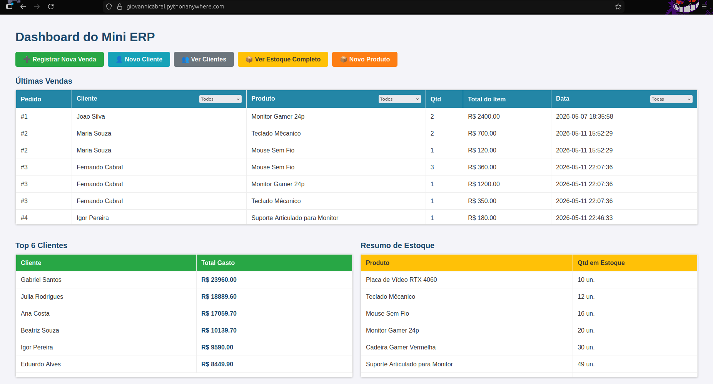
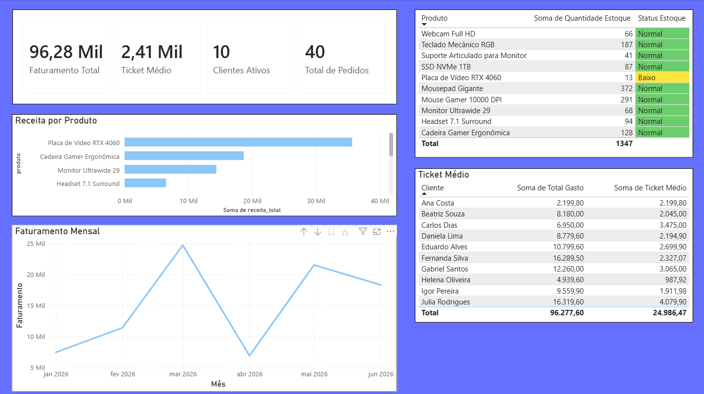

# 🛒 Mini ERP — Sistema de Gestão com Integração Power BI

Aplicação web full-stack que simula um sistema ERP para pequenas empresas, desenvolvida para demonstrar habilidades práticas com **SQL, Python e integração com Power BI**. Conta com fluxo completo de vendas, controle de estoque, dashboard analítico e uma **camada de API JSON** que alimenta dashboards interativos no Power BI com KPIs e indicadores gerenciais.

🔗 **Deploy:** [giovannicabral.pythonanywhere.com](https://giovannicabral.pythonanywhere.com)

---

## 📸 Screenshots

### Dashboard Flask


### Dashboard Power BI


---

## ✨ Funcionalidades

- **Fluxo de vendas** — carrinho por sessão, pedidos com múltiplos itens, validação de estoque antes de finalizar
- **Gestão de clientes e produtos** — CRUD completo com proteção por integridade referencial
- **Dashboard analítico** — relatório filtrável (por cliente, produto e data), ranking dos top 6 clientes e alertas de estoque baixo
- **API JSON para Power BI** — 5 endpoints REST que expõem KPIs, série temporal e rankings calculados via SQL
- **Script de seed** — gera dados realistas para teste (10 clientes, 10 produtos, 40 pedidos aleatórios)

---

## 📊 Integração com Power BI

O arquivo `api.py` expõe endpoints REST que o Power BI consome via **Web connector**. Cada rota executa uma query SQL analítica e retorna JSON estruturado.

| Endpoint | Descrição | SQL utilizado |
|---|---|---|
| `/api/kpis` | Faturamento total, ticket médio, pedidos, clientes ativos, produto top | CTE com múltiplos agregados |
| `/api/vendas_por_mes` | Faturamento mensal para série temporal | `strftime` + `GROUP BY` |
| `/api/ranking_produtos` | Produtos por receita com status de estoque | `CASE WHEN` + `JOIN` + `GROUP BY` |
| `/api/ranking_clientes` | Clientes por valor gasto com ticket médio | `ROW_NUMBER()` + `JOIN` + `GROUP BY` |
| `/api/estoque` | Posição atual do estoque com classificação de criticidade | `LEFT JOIN` + `CASE WHEN` + `COALESCE` |

**Como conectar no Power BI Desktop:**

1. Abra o Power BI Desktop → *Obter Dados* → **Web**
2. Cole a URL: `https://giovannicabral.pythonanywhere.com/api/kpis`
3. Selecione *Lista* → *Converter em Tabela*
4. Repita para cada endpoint que deseja usar
5. Em *Modelo*, relacione as tabelas pelos campos `cliente` e `produto`

---

## 🗄️ Banco de Dados — Conceitos SQL Demonstrados

Construído em SQL puro (sem ORM), com modelagem relacional progressiva:

| Conceito | Onde |
|---|---|
| Schema relacional com Foreign Keys | `setup_database.py` — 4 tabelas normalizadas |
| `TRIGGER` (atualização automática de estoque) | `AFTER INSERT ON itens_pedido` → desconta `produtos.quantidade_estoque` |
| `VIEW` de relatório (JOIN de 3 tabelas) | `vw_relatorio_vendas` — desnormalização reutilizável |
| `VIEW` de série temporal | `vw_vendas_mensais` — `strftime` + `GROUP BY` por mês |
| `VIEW` de KPIs com `CTE` | `vw_kpis_gerenciais` — múltiplos `WITH` combinados em uma linha |
| `VIEW` de ranking com `CASE WHEN` | `vw_ranking_produtos` — classificação de criticidade de estoque |
| `ROW_NUMBER()` (window function) | `/api/ranking_clientes` — posição por valor gasto |
| `COALESCE` para produtos sem vendas | `/api/estoque` — `LEFT JOIN` sem nulls |
| Filtragem dinâmica parametrizada | Padrão `WHERE 1=1` com filtros encadeados no dashboard |
| Controle de transação (`COMMIT` / `ROLLBACK`) | Validação de estoque com rollback total em falha |

---

## 🛠️ Tecnologias

- **Backend:** Python 3, Flask
- **Banco de dados:** SQLite3 (SQL puro, sem ORM)
- **Integração BI:** API REST JSON
- **Frontend:** Jinja2, HTML/CSS
- **Deploy:** PythonAnywhere

---

## 🚀 Rodando Localmente

```bash
# 1. Clone o repositório
git clone https://github.com/GiovanniCabralO/python-sqlite-mini-erp
cd python-sqlite-mini-erp

# 2. Crie e ative o ambiente virtual
python -m venv venv
source venv/bin/activate  # Windows: venv\Scripts\activate

# 3. Instale as dependências
pip install -r requirements.txt

# 4. Crie o arquivo .env
echo "SECRET_KEY=sua-chave-secreta" > .env

# 5. Configure o banco de dados (tabelas, trigger e views)
python setup_database.py

# 6. (Opcional) Popule com dados de exemplo
python seed.py

# 7. Inicie o servidor
python app.py
```

Acesse [http://localhost:5000](http://localhost:5000).

Endpoints da API disponíveis em:
- `http://localhost:5000/api/kpis`
- `http://localhost:5000/api/vendas_por_mes`
- `http://localhost:5000/api/ranking_produtos`
- `http://localhost:5000/api/ranking_clientes`
- `http://localhost:5000/api/estoque`

---

## 📁 Estrutura do Projeto

```
python-sqlite-mini-erp/
├── app.py                 # Rotas Flask + registro do Blueprint de API
├── api.py                 # Endpoints REST JSON para integração Power BI
├── setup_database.py      # Schema: tabelas, trigger, 4 views analíticas
├── seed.py                # Gerador de dados de teste realistas
├── requirements.txt
├── .env                   # SECRET_KEY (não commitado)
├── .gitignore
└── templates/
    ├── index.html         # Dashboard com filtros
    ├── nova_venda.html    # Carrinho e checkout
    ├── estoque.html       # CRUD de produtos
    ├── clientes.html      # CRUD de clientes
    └── ...
```

---

## 📌 Autor

**Giovanni Cabral** — Estudante de Engenharia da Computação na Facens | Estagiário de Python & Automação na Huawei Technologies

[GitHub](https://github.com/GiovanniCabralO) · [LinkedIn](https://www.linkedin.com/in/giovannicabraldeoliveira)